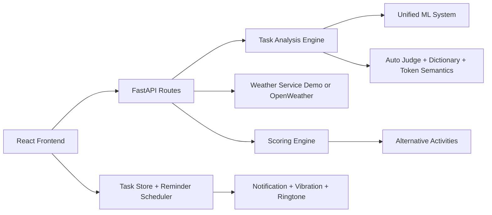

# SkyCoach AI

Weather-aware task planning system. FastAPI backend + React frontend, with a hybrid ML/dictionary/token-semantics classifier and a reminder-driven todo workflow.

## Runtime Defaults

- Backend API: <http://127.0.0.1:8012>
- Backend docs: <http://127.0.0.1:8012/docs>
- Frontend: <http://127.0.0.1:5173/index.html>
- Local inference confidence threshold: 0.62

## System Overview



## Feature Set

### Task Intelligence

- Hybrid local analysis combining ML, dictionary, and token semantics.
- Optional OpenAI path when enabled per request and key is present.
- Clarification and suggestion fields for ambiguous user input.

### Planner and Scoring

- Live or deterministic demo weather.
- Coordinate-aware weather lookup.
- Weather-based score plus alternatives and best schedule recommendation.

### Todo and Timetable UX

- One-week timetable scheduling with conflict-aware slot handling.
- Reminder engine with browser notifications, vibration, and ringtone presets.
- Due-time Activity Check workflow:
  - Yes, completed: remove completed due task.
  - No, reschedule: move to next best available slot.

## API Surface

- POST /api/analyze-task
- POST /api/weather
- POST /api/score
- POST /api/analyze
- GET /api/alternatives
- GET /api/health
- POST /api/predict
- POST /api/feedback
- GET /api/learning-status
- POST /api/chat-assistant
- POST /api/backend-cli

## Quick Start

### 1) Install dependencies

```powershell
python -m pip install -r requirements.txt
```

```powershell
cd frontend
npm install
```

### 2) Configure environment

Copy `.env.example` to `.env` and fill in (both keys optional — app falls back to demo if absent):

```env
OPENAI_API_KEY=sk-...
OPENWEATHER_API_KEY=...
OPENAI_MODEL=gpt-4o-mini
```

Frontend defaults live in `frontend/.env.local`:

```env
VITE_API_URL=http://127.0.0.1:8012
VITE_USE_DEMO_WEATHER=false
```

### 3) Run backend

```powershell
python -m uvicorn backend.main:app --host 127.0.0.1 --port 8012
```

### 4) Run frontend

```powershell
cd frontend
npm run dev -- --host 127.0.0.1 --port 5173
```

### 5) Open app

- <http://127.0.0.1:5173/index.html>
- <http://127.0.0.1:8012/docs>

## Tests

```powershell
.\run_backend_tests.cmd
```

## Documentation Index

- docs/README.md
- docs/architecture/system_design.md
- docs/backend/api_routes.md
- docs/backend/ai_engine.md
- docs/frontend/components.md
- docs/frontend/hooks.md
- docs/frontend/services.md
