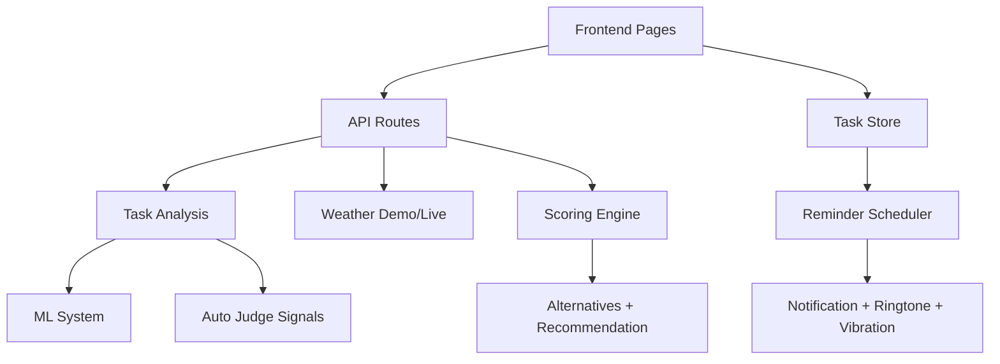

# Documentation Index

This documentation reflects the current SkyCoach architecture and runtime behavior.

## Current Runtime Facts

- Local dev backend: <http://127.0.0.1:8012>
- Local dev frontend: <http://127.0.0.1:5173/index.html>
- Task analysis flow: hybrid smart analyzer (local by default, OpenAI optional per request)
- Reminder flow: due detection + prompt + complete or reschedule
- Inference confidence threshold: 0.62

## Architecture Map

## Core Docs

- `codebase_file_reference.md` (file-by-file responsibilities, symbols, routes, and dependencies)
- `architecture/system_design.md`
- `architecture/deep_dive.md`
- `backend/ai_engine.md`
- `backend/api_routes.md`
- `architecture/ml_system/overview.md`
- `architecture/ml_system/integration.md`
- `architecture/ml_system/quick_reference.md`
- `architecture/ml_system/training_and_data.md`
- `frontend/components.md`
- `frontend/services.md`
- `frontend/hooks.md`
- `datasets/data_models.md`
- `datasets/activity_corpus.md`

## Recommended Reading Order

1. `codebase_file_reference.md`
2. `architecture/system_design.md`
3. `architecture/deep_dive.md`
4. `backend/api_routes.md`
5. `backend/ai_engine.md`
6. `architecture/ml_system/overview.md`
7. `architecture/ml_system/integration.md`
8. `architecture/ml_system/training_and_data.md`
9. `architecture/ml_system/quick_reference.md`
