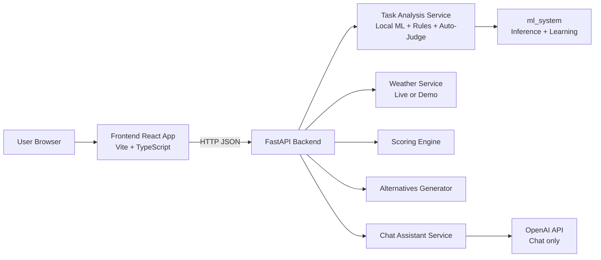
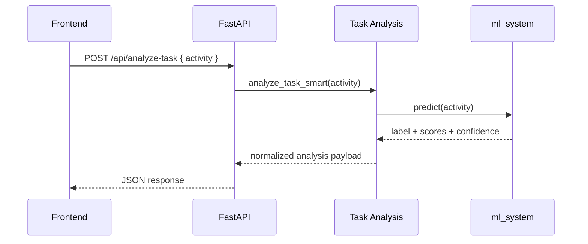

# System Deep Dive

This document is the comprehensive architecture reference for SkyCoach AI.

## 1. Scope

SkyCoach combines:

- Task intent and location-type classification (Indoor, Outdoor, Mixed, Unclear)
- Weather-aware scoring and alternatives
- Frontend planning workflows (dashboard, planner, timetable, todo)
- Optional chat-assistant capability

The active production-style behavior in this repository is:

- Local ML for task analysis and prediction workflows
- OpenAI used for chat assistant flow only
- FastAPI backend on 127.0.0.1:8012 by default
- React/Vite frontend on 127.0.0.1:5173 by default

## 2. Topology



## 3. Request Lifecycles

### 3.1 Analyze Task

Endpoint: POST /api/analyze-task

Primary purpose:

- Classify an activity phrase into Indoor/Outdoor/Mixed/Unclear
- Return confidence and rationale
- Return clarifying suggestions when confidence is low



### 3.2 Full Analyze Pipeline

Endpoint: POST /api/analyze

Primary purpose:

- Run classification + weather + scoring + alternatives in one call

```mermaid
sequenceDiagram
    participant FE as Frontend
    participant API as FastAPI
    participant TAS as Task Analysis
    participant WX as Weather
    participant SCORE as Scoring Engine
    participant ALT as Alternatives

    FE->>API: POST /api/analyze { activity, location, ... }
    API->>TAS: analyze_task_smart(...)
    TAS-->>API: task result
    API->>WX: get_weather(...)
    WX-->>API: weather snapshot
    API->>SCORE: calculate(task, weather)
    SCORE-->>API: score_result
    API->>ALT: suggest(task, weather)
    ALT-->>API: alternatives
    API-->>FE: { task, weather, score_result, alternatives }
```

### 3.3 Chat Assistant Boundary

Endpoint: POST /api/chat-assistant

- This flow can call OpenAI.
- Classification routes do not require OpenAI.

## 4. Module Responsibilities

### 4.1 Backend Layer

- API routing, validation, response formatting
- Service orchestration and failure handling
- Integration with ml_system and scoring/weather services

### 4.2 ml_system Layer

- Tokenization
- Model inference
- Confidence calibration and thresholding
- Feedback ingestion
- Retraining orchestration and artifact management

### 4.3 Weather and Score Layer

- Weather retrieval (live with API key, or demo/fallback)
- Numeric score generation from weather + task-type compatibility
- Explanation and alternatives generation

### 4.4 Frontend Layer

- Form/state management for activity analysis
- API service integration
- Visualization cards (analysis, score, alternatives, weather)
- Planner-oriented page composition

## 5. Data Contracts

### 5.1 Predict-style output

Common keys from ml_system prediction payloads:

- label
- confidence
- rationale
- model
- all_scores
- suggestions

Compatibility aliases may also exist in API wrappers:

- predicted_label
- predicted_confidence

### 5.2 Full analysis output

Core response shape for POST /api/analyze:

- task
- weather
- score_result
- alternatives

## 6. Confidence and Decision Policy

Runtime defaults include:

- confidence threshold: 0.62
- temperature scaling: 0.50

Policy behavior:

- High-confidence class -> direct label
- Low-confidence or conflicting evidence -> Unclear plus suggestions
- User feedback can later correct uncertain predictions

## 7. Failure Modes and Fallbacks

### 7.1 Backend/API errors

- Input validation errors should return clear client-facing messages
- Internal exceptions should be logged with enough context for debugging

### 7.2 Weather failures

- If live weather source fails or key is unavailable, demo/fallback path should still allow analysis flow

### 7.3 ML uncertainty

- Unclear is a valid outcome, not a crash condition
- Suggestions are used to collect clarification and improve downstream confidence

## 8. Observability Checklist

Recommended baseline logging and checks:

- Request IDs for API calls
- Route-level latency metrics (analyze-task, analyze, predict)
- Prediction confidence histograms by class
- Feedback volume and correction distribution
- Retraining trigger and model promotion logs

## 9. Deployment and Runtime Notes

### Local defaults

- Backend: http://127.0.0.1:8012
- Frontend: http://127.0.0.1:5173/index.html

### Container support

- Dockerfiles exist for backend and frontend
- docker-compose exists for combined deployment scenarios

## 10. Practical QA Scenarios

1. High-confidence Indoor phrase returns Indoor without clarification.
2. Ambiguous phrase returns Unclear with suggestions.
3. Full analyze returns all four top-level sections.
4. Chat assistant route works when OpenAI key is configured.
5. Predict and feedback routes update learning status over time.

## 11. Traceability Map

Use this map for quick navigation:

- API route definitions: backend/api/routes.py
- Backend app entrypoint: backend/main.py
- ML API singleton: ml_system/api.py
- Tokenizer and models: ml_system/training/
- Training config: ml_system/config/settings.py
