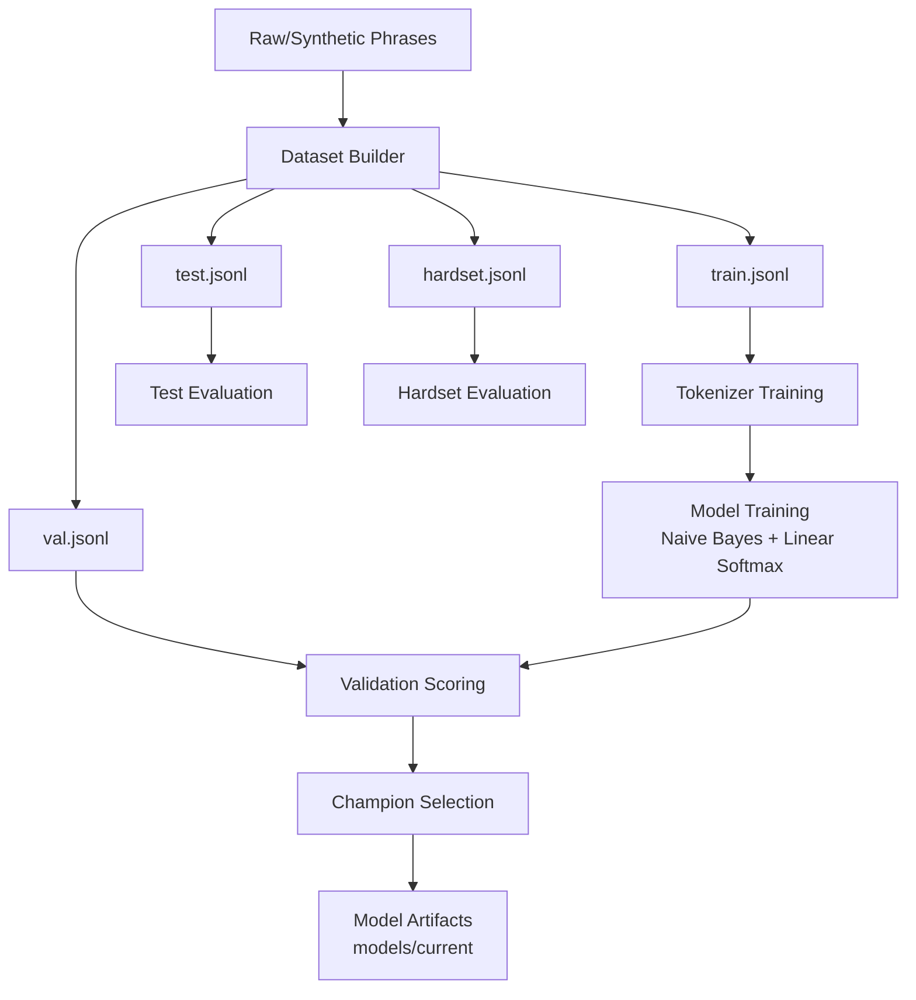
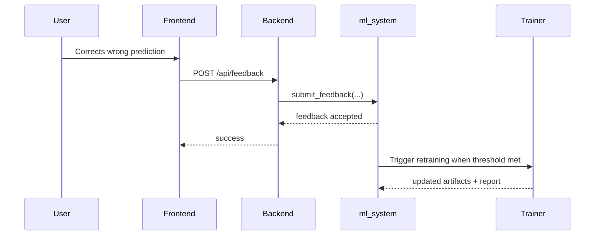

# ML Training and Data Pipeline

This document explains how SkyCoach builds, evaluates, and improves the local classification model.

## 1. Objectives

The ML pipeline targets four labels:

- Indoor
- Outdoor
- Mixed
- Unclear

The system is designed to:

- Classify short natural-language activity phrases
- Stay robust to misspellings and casual grammar
- Learn from user feedback and uncertain predictions

## 2. Pipeline Overview



## 3. Data Sources and Generation

### 3.1 Core dataset files

- ml_system/data/datasets/train.jsonl
- ml_system/data/datasets/val.jsonl
- ml_system/data/datasets/test.jsonl
- ml_system/data/datasets/hardset.jsonl

### 3.2 Massive synthetic generator

Script:

- ml_system/data/datasets/generate_massive_dataset.py

Default behavior:

- Balanced label generation
- Lexical variation by templates and style prefixes
- Time-context variation
- Noise injection for typo/grammar robustness

CLI example:

```powershell
python -m ml_system.data.datasets.generate_massive_dataset --per-label 50000 --output-dir ml_system/data/datasets
```

Resulting summary artifact example:

- ml_system/data/datasets/massive_dataset_summary.json

## 4. Tokenization Strategy

Tokenizer implementation is in ml_system/training/tokenizer.py.

Current behavior includes:

- Text normalization
- Word-level tokenization
- Character n-gram feature expansion with cg\_ prefix

Character n-grams are intended to improve resilience when users type:

- misspellings
- partial words
- morphologically varied forms

Configuration dimensions include:

- min token frequency
- max vocabulary size
- char n-gram min/max length

## 5. Model Training and Selection

Trainer implementation is in ml_system/training/trainer.py.

Training flow:

1. Load train/val/test/hardset splits
2. Fit tokenizer on training text
3. Train candidate models
4. Evaluate on validation split
5. Select champion model
6. Evaluate champion on test and hardset
7. Persist artifacts and report

Core configurable values come from:

- ml_system/config/settings.py

Examples include:

- tokenizer_max_vocab
- tokenizer_min_freq
- laplace_alpha
- learning_rate
- epochs
- l2_regularization

## 6. Inference and Confidence Policy

Runtime policy highlights:

- confidence threshold around 0.62
- temperature scaling around 0.50
- low-confidence handling through Unclear and suggestions

This policy helps reduce overconfident wrong labels on ambiguous phrases.

## 7. Feedback and Continuous Learning

Feedback route:

- POST /api/feedback

Status route:

- GET /api/learning-status

Learning loop:



## 8. Evaluation Guidance

### 8.1 What to track

- Macro F1 (validation, test, hardset)
- Per-class precision/recall/F1
- Confusion matrix
- Confidence calibration distribution

### 8.2 Interpreting very high scores

If scores approach near-perfect values, validate for:

- train/test leakage
- synthetic-template overlap
- insufficiently adversarial hardset

High scores can be valid, but should be confirmed with realistic, out-of-template phrases.

## 9. Recommended Hardset Strategy

Hardset should include:

- heavy misspellings
- short/noisy mobile-style input
- slang and code-mixing cases
- contradictory context phrases
- intentionally ambiguous activities

## 10. Operational Commands

Generate large dataset:

```powershell
python -m ml_system.data.datasets.generate_massive_dataset --per-label 50000 --output-dir ml_system/data/datasets
```

Run training (example through API singleton in a Python shell):

```python
from ml_system.api import get_ml_system
ml = get_ml_system()
ml.train(
    "ml_system/data/datasets/train.jsonl",
    "ml_system/data/datasets/val.jsonl",
    "ml_system/data/datasets/test.jsonl",
    "ml_system/data/datasets/hardset.jsonl",
)
```

Validate health and status:

```powershell
Invoke-WebRequest -Uri http://127.0.0.1:8012/api/health
Invoke-WebRequest -Uri http://127.0.0.1:8012/api/learning-status
```

## 11. Risk Register

- Synthetic bias risk: generated text may not match true user phrasing distribution
- Overfitting risk: repeated template skeletons can inflate benchmark scores
- Drift risk: language style changes over time without fresh feedback

Mitigations:

- Keep collecting user feedback
- Maintain a curated real-world evaluation set
- Re-run periodic calibration and threshold tuning
