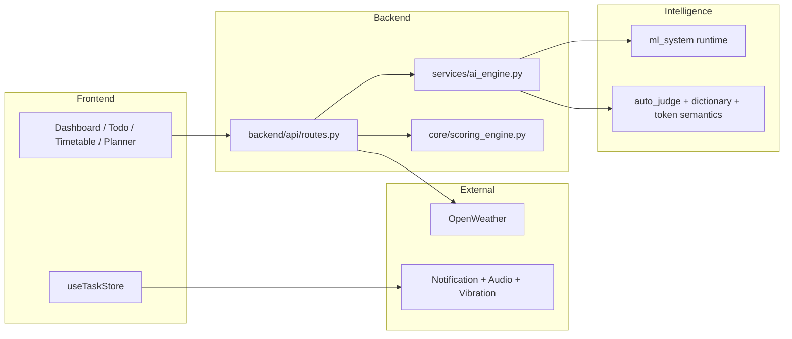
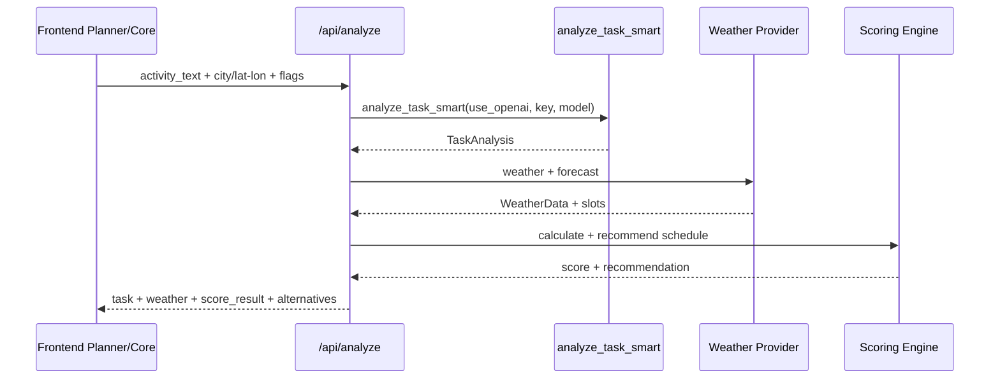
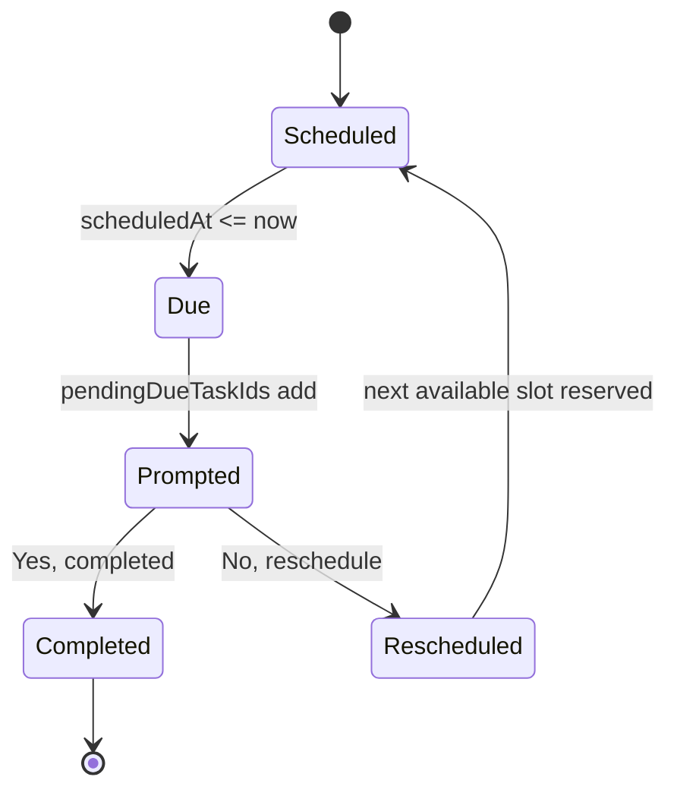

# System Design

For full architecture, operational flow diagrams, and failure-mode guidance, see:

- `docs/architecture/deep_dive.md`
- `docs/architecture/ml_system/training_and_data.md`

## High-Level Architecture

- Frontend: React + TypeScript + Vite
- Backend: FastAPI
- ML runtime: unified `ml_system`
- Supporting engines: auto-judge, weather, scoring

## Runtime Topology

## Current Classification Path

1. Frontend submits activity text to `POST /api/analyze-task` or `POST /api/analyze`.
2. Backend calls `analyze_task_smart(...)` with request-level OpenAI toggle and key.
3. If OpenAI is enabled and key is present, OpenAI path is used.
4. Otherwise, hybrid local ML + dictionary + semantic signals are combined.
5. Clarification and suggestions are returned when confidence is low or ambiguity is detected.

## OpenAI Boundary

- OpenAI can be used by analysis endpoints when `use_openai=true` and a key is provided.
- Chat assistant endpoint remains OpenAI-first by design.
- Local fallback remains the default and resilience path.

## Pipeline in `POST /api/analyze`

1. Task analysis
2. Weather retrieval (demo or live key)
3. Score calculation
4. Alternative activity generation

## Todo Reminder Decision Loop

Response keys:

- `task`
- `weather`
- `score_result`
- `alternatives`

## Runtime Defaults

- Backend: 127.0.0.1:8012
- Frontend: 127.0.0.1:5173
- Confidence threshold: 0.62
